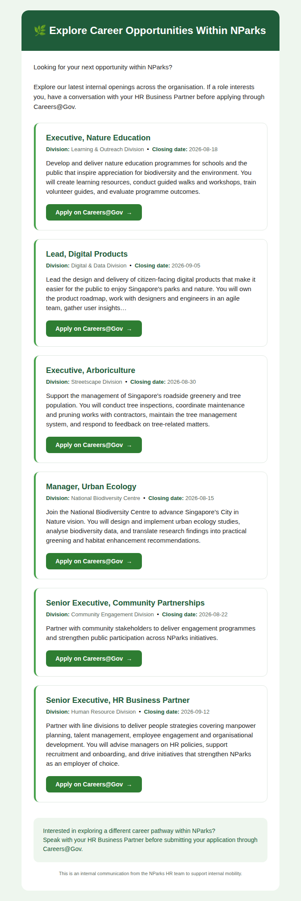

# 🌿 NParks Internal Opportunities eDM Generator

A lightweight tool that retrieves currently open **National Parks Board (NParks)**
vacancies from **Careers@Gov** and generates a professional, **Outlook-ready HTML
eDM** that HR can copy and paste straight into a new Microsoft Outlook email.

The goal is to encourage **internal mobility** by making it easy for NParks staff
to discover opportunities across the organisation.



---

## What it does

1. **Retrieve current vacancies** — on demand ("Refresh Vacancies"), filtered to
   NParks vacancies that are *open for application*. Expired/closed roles and
   duplicates are ignored. Extracts job title, division, closing date, job
   description and the Careers@Gov application link.
2. **AI summary** — a concise, factual 25–40 word one-liner per role (via Claude
   if configured, otherwise a deterministic extractive fallback that never
   invents information).
3. **Generate eDM** — a modern, Outlook-compatible HTML email with NParks green
   accents, a clean white background and rounded vacancy cards.
4. **Simple admin page** — edit summaries, hide/show roles, reorder them, and
   preview / copy the final eDM. No login or approval workflow.
5. **Outlook output** — click *Generate eDM* → *Copy HTML* → paste into a new
   Outlook email with formatting preserved. No Microsoft Graph / auto-send.

An **optional** administrator-configurable schedule (hourly/daily/weekly) can
auto-refresh vacancies; it is **off by default** (refresh is on demand).

---

## Tech stack

| Layer     | Technology                                   |
| --------- | -------------------------------------------- |
| Frontend  | React + TypeScript + Vite + Tailwind CSS     |
| Backend   | Python + FastAPI                             |
| Storage   | SQLite (via SQLAlchemy)                       |
| AI        | Anthropic Claude (optional) + local fallback |
| Scheduler | APScheduler (optional)                       |

```
edm-generator/
├── backend/            # FastAPI app
│   ├── app/
│   │   ├── main.py         # App entry point + lifespan (DB init, scheduler)
│   │   ├── config.py       # Env-driven settings
│   │   ├── database.py     # SQLAlchemy engine/session + init
│   │   ├── models.py       # Vacancy ORM model
│   │   ├── schemas.py      # Pydantic request/response models
│   │   ├── routers/        # API endpoints
│   │   ├── services/       # scraper, summarizer, edm builder, refresh, scheduler
│   │   └── data/           # bundled sample dataset (offline fallback)
│   ├── requirements.txt
│   └── .env.example
├── frontend/           # React + TS + Tailwind admin UI
│   ├── src/
│   │   ├── App.tsx
│   │   ├── api.ts
│   │   └── components/     # Toolbar, VacancyRow, PreviewModal
│   └── .env.example
└── docs/               # sample eDM (HTML + screenshot)
```

---

## Getting started

### Prerequisites

- Python 3.10+
- Node.js 18+

### 1. Backend

```bash
cd backend
python3 -m venv .venv
source .venv/bin/activate          # Windows: .venv\Scripts\activate
pip install -r requirements.txt

cp .env.example .env               # then edit as needed (all values optional)
uvicorn app.main:app --reload --port 8000
```

- API docs: <http://localhost:8000/docs>
- Health check: <http://localhost:8000/api/health>

### 2. Frontend

```bash
cd frontend
npm install
cp .env.example .env               # optional
npm run dev                        # http://localhost:5173
```

The Vite dev server proxies `/api` to the backend on port 8000, so no extra
configuration is needed for local development.

### 3. Use it

1. Open the admin UI at <http://localhost:5173>.
2. Click **Refresh Vacancies**.
3. Tidy the AI summaries, hide any roles you don't want, and reorder as needed.
4. Click **Generate & Preview eDM**, review it, then **Copy HTML**.
5. Open a new Outlook email and paste (Ctrl/Cmd + V) into the body.

---

## Configuration

All configuration is via environment variables (see `backend/.env.example`).
Highlights:

| Variable                | Default                          | Purpose                                             |
| ----------------------- | -------------------------------- | --------------------------------------------------- |
| `DATABASE_URL`          | `sqlite:///./edm.db`             | Any SQLAlchemy URL.                                 |
| `CAREERS_AGENCY`        | `National Parks Board`           | Agency to filter vacancies by.                      |
| `CAREERS_SEARCH_URL`    | Careers@Gov search endpoint      | Best-effort JSON search endpoint (see note below).  |
| `USE_SAMPLE_FALLBACK`   | `true`                           | Use bundled sample data if the live source fails.   |
| `AUTO_REFRESH_ENABLED`  | `false`                          | Enable the optional background refresh schedule.    |
| `AUTO_REFRESH_INTERVAL` | `daily`                          | `hourly` \| `daily` \| `weekly`.                    |
| `ANTHROPIC_API_KEY`     | *(empty)*                        | Enables Claude-generated summaries when set.        |
| `ANTHROPIC_MODEL`       | `claude-haiku-4-5-20251001`      | Model used for summaries.                           |
| `SUMMARY_MIN/MAX_WORDS` | `25` / `40`                      | Target summary length.                              |
| `CORS_ORIGINS`          | `http://localhost:5173,...`      | Allowed frontend origins.                           |

---

## API overview

| Method | Path                          | Description                                  |
| ------ | ----------------------------- | -------------------------------------------- |
| GET    | `/api/health`                 | Liveness probe.                              |
| GET    | `/api/config`                 | Runtime config + vacancy counts.             |
| POST   | `/api/vacancies/refresh`      | Retrieve + upsert current open vacancies.    |
| GET    | `/api/vacancies`              | List all vacancies (admin, includes hidden). |
| PATCH  | `/api/vacancies/{id}`         | Edit summary / visibility / core fields.     |
| POST   | `/api/vacancies/reorder`      | Set display order from an ordered id list.   |
| GET    | `/api/edm`                    | Generate the Outlook-ready eDM HTML.         |

---

## Note on the Careers@Gov data source

Careers@Gov is a dynamic single-page application whose underlying search
endpoint and HTML markup are **not a documented, stable public API** and can
change without notice. The scraper (`app/services/scraper.py`) is therefore
written defensively:

1. It attempts a best-effort request to a configurable JSON search endpoint and
   normalises several plausible response shapes.
2. Failing that, it falls back to parsing the HTML results page with generic
   selectors.
3. If the live source is unreachable (e.g. restricted network) or returns
   nothing usable, it falls back to a **bundled sample dataset** so the tool
   remains fully usable for demos and training (`USE_SAMPLE_FALLBACK=true`).

When deploying in an environment with network access to Careers@Gov, verify /
adjust `CAREERS_SEARCH_URL` and the selectors in `scraper.py` against the live
portal. All retrieval steps are logged, and errors surface clearly in the admin
UI (including whether data came from the *live* source or the *sample*
fallback).

---

## Design notes

- **Outlook compatibility.** The eDM uses nested tables, fully inline styles,
  a fixed 600px centered container and bulletproof table-based buttons — the
  patterns that survive Outlook's Word-based rendering engine.
- **Faithful summaries.** Both the AI and fallback summarisers are constrained
  to the source description and instructed/designed not to invent details.
- **Edit protection.** Once HR edits a summary, subsequent refreshes will not
  overwrite it (`summary_edited` flag).
- **Extensible.** Clean separation between retrieval, summarisation, eDM
  rendering and persistence makes it straightforward to add features later.
